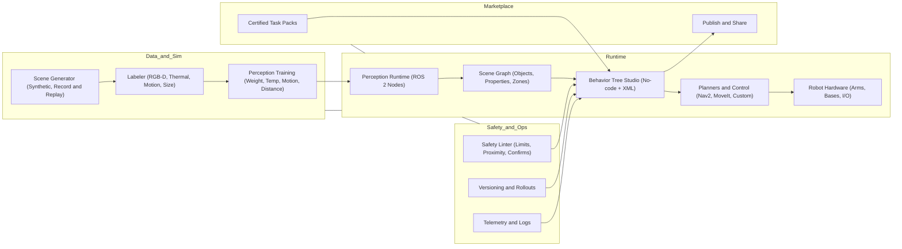

# Robotics operating system

<p align="center">Create &amp; test robots in minutes — from camera to workflow to real-world execution.</p>

<p align="center"><a href="https://your-app.link/signup" class="button primary">Sign up</a> <a href="https://your-app.link/login" class="button secondary">Log in</a></p>

---

**A modular robot OS for doers.**
It fuses three pillars:

1. **Perception** — a multimodal model that understands objects *and* useful properties (distance, motion/speed, temperature class via thermal, weight class via size + material priors).
2. **Planning & Workflow** — an n8n-style **Behavior Tree Studio** to compose tasks with guardrails, retries, and fallbacks.
3. **Execution & Simulation** — one-click **Sim→Real**: dry-run in high-fidelity sim, then deploy to your ROS 2 stack.

**Who it’s for:** founders, ops teams, integrators, and researchers who want plug-and-play robotics without rebuilding middleware.

---

## 2) Key features & differentiators

<table data-view="cards"><tbody>

<tr>
<td><h4>🧠</h4></td>
<td><strong>Task-relevant perception</strong></td>
<td>Distance, motion, temperature class (thermal), weight class (size + priors). Signals designed for decisions, not just labels.</td>
<td><a href="https://docs.your-site/perception">Perception docs</a></td>
<td><a href=".gitbook/assets/perception.png">perception.png</a></td>
</tr>

<tr>
<td><h4>🧩</h4></td>
<td><strong>Behavior Tree Studio</strong></td>
<td>No-code node editor that wires perception into actions. Export/import BT XML; runs atop ROS 2, Nav2, MoveIt.</td>
<td><a href="https://docs.your-site/workflows">Workflow guide</a></td>
<td><a href=".gitbook/assets/bt-studio.png">bt-studio.png</a></td>
</tr>

<tr>
<td><h4>🖥️</h4></td>
<td><strong>Sim→Real by design</strong></td>
<td>Record &amp; replay scenes, generate synthetic data, validate workflows in sim before enabling motors. Domain randomization + safety linting included.</td>
<td><a href="https://docs.your-site/simulation">Simulation</a></td>
<td><a href=".gitbook/assets/sim.png">sim.png</a></td>
</tr>

<tr>
<td><h4>🛡️</h4></td>
<td><strong>Safety guardrails</strong></td>
<td>Speed/joint limits, proximity rules, capability-scoped nodes, human-in-the-loop confirms. Hardware interlocks + software watchdogs.</td>
<td><a href="https://docs.your-site/safety">Safety</a></td>
<td><a href=".gitbook/assets/safety.png">safety.png</a></td>
</tr>

<tr>
<td><h4>🛒</h4></td>
<td><strong>Marketplace (alpha)</strong></td>
<td>Certified task packs (pick-place, sort by temp/weight, hot-tray handling). Revenue share for creators; capability manifests keep deployments safe.</td>
<td><a href="https://docs.your-site/marketplace">Marketplace</a></td>
<td><a href=".gitbook/assets/marketplace.png">marketplace.png</a></td>
</tr>

<tr>
<td><h4>🔌</h4></td>
<td><strong>Hardware-friendly</strong></td>
<td>ROS 2 drivers and templates for common arms and mobile bases. Reference sensor kit (RGB-D + thermal) and optional tactile/scale add-ons.</td>
<td><a href="https://docs.your-site/hardware">Hardware</a></td>
<td><a href=".gitbook/assets/hardware.png">hardware.png</a></td>
</tr>

</tbody></table>

---

## 3) Ecosystem & platform vision

**A loop where each part strengthens the others:**

* **Perception engine** improves via synthetic + real data, then serves richer signals (e.g., “hot & light object”).
* **BT Studio** lets anyone wire those signals into tasks with retries, fallbacks, and guardrails.
* **Simulation** validates tasks, generates edge cases, and feeds new labels back into perception.
* **Marketplace** distributes proven behaviors so integrators ship faster and earn from their playbooks.
* **Hardware integrations** keep friction low: standard interfaces, calibration wizards, and example projects.

**Open where it matters:** ROS 2 compatible, BT XML import/export, SDK for custom nodes, data connectors for your MLOps stack.

---

## 4) Roadmap / current status / scope

**Now (Pilot Program)**

* Perception v0 (distance, motion, temp-class, weight-class).
* BT Studio v0 (core nodes, guards, logging, sim dry-run).
* Reference kit (RGB-D + thermal; UR/RO1-class arms).
* 3 pilot templates: Hot-Tray Handover, Weight-Sorted Kitting, Follow-and-Handover.

**Next 3–6 months**

* Synthetic data pipeline + record/replay.
* Safety linter (speed/joint envelopes, proximity rules, two-person confirm).
* Marketplace (closed alpha) for certified task packs.

**6–12 months**

* Perception v1 (few-shot adapters on customer sites, stronger material priors).
* Fleet ops: job queueing, remote logs, versioned rollouts.
* Expanded hardware modules + partner drivers.

**Scope & principles**

* Build on ROS 2, Nav2, MoveIt.
* Multimodal by default (RGB-D + thermal).
* “Sim before spin”: no workflow runs on hardware without a matching sim pass.

---

## 5) Ecosystem diagram

**You bring a robot and a task. We bring perception, a friendly workflow editor, and a safety-first path from sim to real. Share or sell your workflows in the marketplace and compound the ecosystem.**



---

### Get started in 5 minutes

Pick a hardware profile, connect sensors, open BT Studio. Choose a template, hit **Simulate**, then deploy to your ROS 2 graph.

<a href="https://your-app.link/start" class="button primary" data-icon="rocket-launch">Get started</a> <a href="https://your-app.link/api" class="button secondary" data-icon="terminal">API reference</a>



```ts
import { Client } from "@yourorg/robot-os";

const sdk = new Client({ apiKey: process.env.API_KEY });

const wf = await sdk.workflows.create({
  name: "Hot-Tray Handover",
  hardwareProfile: "ur10e_rgbd_thermal",
  template: "hot_tray_handover_v1",
  safety: { requireHumanConfirm: true }
});

await sdk.workflows.simulate(wf.id, { scene: "kitchen_line_a" });
await sdk.workflows.deploy(wf.id, { robotId: "ROBOT-001" });
```

<figure>
  
  <figcaption>From Sim → Real in one click.</figcaption>
</figure>

### Learn more

Guides, hardware profiles, and step-by-step tutorials to go from idea to on-site pilot.

<a href="https://your-app.link/guides" class="button primary" data-icon="book-open">Guides</a> <a href="https://your-app.link/docs" class="button secondary" data-icon="book">Documentation</a>

---

### Community

<table data-card-size="large" data-view="cards"><tbody>
<tr><td><h4>💬</h4></td><td><strong>Discord</strong></td><td>Get help, share workflows, and showcase builds.</td><td><a href="https://your-community.link" class="button secondary">Join Discord</a></td></tr>
<tr><td><h4>🌟</h4></td><td><strong>GitHub</strong></td><td>SDKs, examples, and issue tracking.</td><td><a href="https://github.com/yourorg/robot-os" class="button secondary">View repo</a></td></tr>
</tbody></table>
